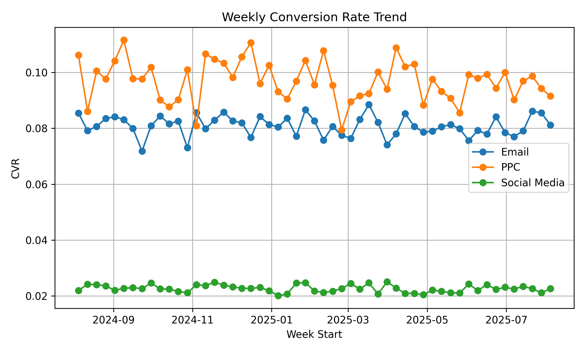

# Project: Marketing Channel Performance Analysis

## Objective
The Parts Avatar marketing team has allocated its budget across three primary channels for the first half of the year: Pay-Per-Click (PPC), Email Marketing, and Social Media advertising. The team needs a comprehensive analysis to understand the effectiveness and return on investment (ROI) of each channel.

Your goal is to ingest and integrate data from these disparate sources, calculate key performance indicators (KPIs), and deliver a clear report with actionable recommendations on where to focus future marketing spend.

## The Challenge
The data for this analysis is fragmented across four different files, each representing a piece of the customer journey. Your primary challenge is to create a single, unified view of marketing performance. You must decide how to join these datasets, handle any potential discrepancies, and calculate meaningful metrics that will drive business decisions. The conceptual part of this task is to define what "performance" means and to tell a clear story with the data.

## Datasets
* `data/ppc_spend.csv`: Daily spend on PPC campaigns.
* `data/email_campaigns.csv`: Data on email campaigns, including number of emails sent and clicks generated.
* `data/social_media_ads.csv`: Daily spend and performance data for social media ads.
* `data/website_conversions.csv`: A log of all sales conversions, including revenue and the marketing channel that sourced the customer.

## Your Tasks
1.  **Data Ingestion & Integration (ETL):**
    * Write a Python script (`src/process_data.py`) to load, clean, and merge the four data sources into a single, aggregated dataset. This dataset should be structured to allow for daily or weekly performance analysis per channel.

2.  **KPI Calculation:**
    * Using your integrated dataset, calculate the following key metrics for each marketing channel:
        * Total Spend
        * Total Clicks & Total Conversions
        * Total Revenue
        * Click-Through Rate (CTR, for social media)
        * Conversion Rate (Conversions / Clicks)
        * Cost Per Click (CPC)
        * Cost Per Acquisition (CPA, or cost per conversion)
        * Return on Investment (ROI) or Return on Ad Spend (ROAS)

3.  **Analysis & Insights:**
    * In a Jupyter Notebook or as part of your report, analyze the calculated KPIs to answer these questions:
        * Which channel has the highest ROI?
        * Which channel is the most and least expensive for acquiring a customer (CPA)?
        * Which channel is most effective at converting clicks into sales?
        * Is there any observable trend in performance over time for any of the channels?

4.  **Visualization & Recommendations:**
    * Create a summary dashboard or a set of clear visualizations (using Matplotlib, Seaborn, Plotly, etc.) that effectively communicate the performance of each channel.
    * Conclude your analysis in this README with a summary of your findings and provide a data-driven recommendation to the marketing team on how they should consider allocating their budget for the next quarter.

## Evaluation Criteria
* **Data Integration Logic:** Your approach to cleaning and merging the different data sources into a coherent model.
* **Accuracy of KPIs:** Correct calculation of standard marketing performance metrics.
* **Analytical Thinking:** Your ability to interpret the KPIs and extract meaningful, non-obvious insights from the data.
* **Communication & Visualization:** The clarity of your charts and the persuasiveness of your final recommendations.

## Disclaimer: Data and Evaluation Criteria
Please be advised that the datasets utilized in this project are synthetically generated and intended for illustrative purposes only. Furthermore, they have been significantly reduced in terms of sample size and the number of features to streamline the exercise. They do not represent or correspond to any actual business data. The primary objective of this evaluation is to assess the problem-solving methodology and the strategic approach employed, not necessarily the best possible tailored solution for the data. 

---

## ⚙️ Processing Pipeline

The pipeline integrates four source datasets into a unified, analysis-ready format, then exports both **daily** and **weekly** KPIs. Here's how it works:

### 1. **Load & Standardize Data**

Each source CSV file is loaded into a Pandas DataFrame with careful preprocessing:

- **Date Parsing:** All `date` columns are parsed using `pd.to_datetime`, and converted to `datetime.date`.
- **Channel Tagging:** Each dataset is labeled with a `channel` (PPC, Email, or Social Media).
- **Missing Column Handling:**

In this section, I needed the Cost Per Click (CPC) metric to calculate several KPIs. However, since the actual CPC values were missing from the dataset, I researched typical industry benchmarks. 
CPC rates generally range from $0.50 to $5.00, so I decided to use the average value of $2.00 as a reasonable estimate for this analysis.  
For the Email channel, actual spend data was missing from the source file. To address this, I researched typical Cost Per Mille (CPM) rates and found that email campaign CPMs generally range from $5 to $50. Based on this, I selected the average rate of $30 CAD per 1000 emails sent as a fair industry-standard estimate. This allowed me to calculate estimated spend and derive performance KPIs such as ROAS and CPA.
Including this calculated spend ensures more accurate comparisons between channels and prevents misclassification of Email as an "organic" or zero-cost channel.

- **PPC:** If `clicks` are missing, they are estimated using an average **CPC of $2.00**.
- **Email:** If `spend` is missing, it's calculated as `emails_sent * ($30 CPM)`.
- **Social Media:** Impressions and clicks are ensured as numeric (missing → 0).

### 2. **Aggregate Website Conversions**

The `website_conversions.csv` dataset is considered the **authoritative source** for measuring conversions and revenue. However, to ensure **accurate integration** with channel-level marketing data, it was **pre-aggregated by `date` and `channel`**, with the following metrics:

* **`revenue`**: Total revenue generated per day per channel
* **`conversions`**: Count of **unique `conversion_id`s** per day per channel

This design prevents **duplication issues** when joining with other datasets (e.g., PPC, Email, Social) on `date` and `channel`.
Had we joined at the raw `conversion_id` level, conversions could be **duplicated across rows**—inflating counts and distorting downstream KPIs like CPA and ROAS.

Also, since individual `conversion_id`s are **not required** for the business KPIs, this grouped structure is both **cleaner** and **more practical** for performance analysis.

### 3. **Coalesce Columns**

To ensure consistency across datasets:
- All numeric columns (`spend`, `clicks`, `emails_sent`, etc.) are coerced to float using `.fillna(0.0)`.
- Any missing columns are created and filled with 0 to ensure join compatibility.

### 4. **Merge Activity with Conversion Logs**

- The PPC, Email, and Social Media datasets are vertically stacked (`pd.concat`).
- The result is **left-joined** with the `conversions` dataset on `date + channel`.
- This ensures **website conversion data is treated as source-of-truth**.

### 5. **Add Time Granularities**

Two datasets are produced:
- `aggregated_daily.csv`: The cleaned, merged dataset with one row per day and channel.
- `aggregated_weekly.csv`: Weekly rollup using `pd.Grouper(freq="W-MON")`, giving `week_start` as a Monday for each entry.

### 6. **Export Outputs**

Final datasets are saved to the `/data` folder:
- `aggregated_daily.csv`
- `aggregated_weekly.csv`

---

## 📊 KPI Definitions

| Metric     | Formula                                   |
|------------|--------------------------------------------|
| **CTR**    | `clicks / impressions`                    |
| **CVR**    | `conversions / clicks`                    |
| **CPC**    | `spend / clicks`                          |
| **CPA**    | `spend / conversions`                     |
| **ROAS**   | `revenue / spend`                         |
| **Email CTR** | `clicks / emails_sent`                |

---

## ✅ Results Summary

| Channel       | Spend      | Revenue    | CPA     | CVR     | ROAS   |
|---------------|------------|------------|---------|---------|--------|
| Email         | $24,709.86 | $443,545.61| $7.36   | 8.1%    | 17.95x |
| PPC           | $107,357.76| $529,386.11| $20.60  | **9.7%**| 4.93x  |
| Social Media  | $53,383.98 | $142,647.07| $29.61  | 2.3%    | 2.67x  |

---

## 📈 Visualizations

### 1. **Which channel has the highest ROI?**  
**Email** marketing has the highest ROAS at **17.95x** — it brings back nearly 18x the money spent. It’s the most cost-efficient channel.

- 

**Trend over time for ROAS**

What it shows:
Email has the highest ROAS, but it’s not as stable as the other channels.
This might mean the timing of email sends affects its performance, so the team should test and optimize send times.
Social Media is volatile with occasional spikes.
PPC remains moderate and steady.
Interpretation: Email campaigns are reliable for revenue generation. Social needs stricter controls or testing.

- 

### 2. **Customer Acquisition Cost (CPA):**
- **Cheapest:** Email at **$7.36 per conversion**
- **Most expensive:** Social Media at **$29.61**
- 

**Trend over time for CPA**

if we look at the CPA Weekly trend we can see that:
Email remains the most cost-effective and consistent.
PPC shows moderate and steady performance, but there is room for cost optimization. It is needed to investigate the spending trend of this channel and compare it to others to ensure resources are being used efficiently. (will be discuss in section: spend_vs_revenue)
Social Media performance is inconsistent, with high acquisition costs and major spikes — a clear opportunity for re-evaluation of strategy.
Spikes: Noticeable around November 2024 and April–May 2025. Likely due to short-term high-spend campaigns that didn’t convert efficiently.
Holidays, product launches, or influencer collaborations might drive traffic but not necessarily conversions.
These swings indicate the need for better targeting, creative testing, or audience refinement.

- 

### 3. **Click-to-Conversion Effectiveness (CVR):**

- **PPC** is the most effective with a **9.7% CVR**, converting more clicks into sales than other channels.

- 

> CVR measures the percentage of people who **click and actually convert**. It reflects how well-targeted and persuasive a channel's ads are.

**Trend over time for CVR**
#### PPC 
- **Highest and most stable CVR** (~9–11%) across the entire timeframe.
- Indicates highly **targeted campaigns**, showing that paid ads are effectively reaching the right audience.
- Ads are likely well-placed, relevant, and linked to optimized landing pages.

> **Strategic takeaway**: Continue leveraging PPC and consider expanding — it's hitting the right audience at the right time.

#### Email 
- **Strong and steady CVR** (~7.5–8.5%), second only to PPC.
- Some fluctuations over time may suggest **opportunities for better segmentation** or **send-time optimization**.

> **Strategic takeaway**: Fine-tune targeting through behavioral data, A/B testing, and timing adjustments.

#### Social Media 
- **Consistently low CVR** (~2–2.5%) despite fluctuations.
- Suggests poor conversion alignment — possibly due to weak targeting, less buying intent, or generic messaging.

> **Strategic takeaway**: Consider repositioning this channel for **awareness or engagement** instead of direct conversions. Revisit audience settings and creative strategies.

- 

### 4. ****Spend vs Revenue****

- 

**Trend over time for CVR**

#### Social Media

Social Media consistently shows lower spend compared to PPC.
This underinvestment might be limiting its potential — with targeted strategy and increased budget, there's an opportunity to unlock higher returns.
The channel shows some revenue peaks, suggesting there are moments of success that could be expanded upon with better timing and allocation.

---

#### PPC 

PPC displays a steady and strategic spend pattern, but the revenue trend is more volatile.
These fluctuations hint at the impact of timing or campaign types. For example, revenue surges during high-demand periods suggest that seasonal or time-sensitive campaigns are effective.
A more dynamic budget allocation — scaling back in calm weeks and boosting during promotional periods — could improve Return on Ad Spend (ROAS).

---

#### Email

Email revenue follows a pattern similar to PPC, especially before March 2025.
However, after March, its performance diverges — revenue begins to dip despite continued spend, indicating a potential decline in engagement or a need for renewed targeting and timing strategy.
These observations point to the importance of campaign timing and content relevance in driving consistent revenue from email efforts.

- 
---

## 📌 Recommendations Summary

## 1. 📬 Focus More on Email Marketing

Email has the best **Return on Ad Spend (ROAS)** at **17.95x**, and the lowest **Customer Acquisition Cost (CPA)** at only **$7.36**.

This means for every **$1 spent on email**, we get **almost $18 in revenue**.

However, **ROAS is not stable** across time. It goes down after **March 2025**. This might be because of bad timing or less interesting content.

**Recommendation:**

- Test the best times and days to send emails.
- Use A/B testing for subject lines and offers.
- Segment users based on behavior to improve results.

---

## 2. 💰 PPC is Strong, But Can Be Smarter

PPC has the **highest Conversion Rate (CVR)** at **9.7%**, which shows our ads are reaching the right people.

But the **CPA is high** at **$20.60** and **ROAS is lower** than Email (only **4.93x**).

Spending is consistent, but revenue goes up and down.

**Recommendation:**

- Review campaign types and focus on high-converting ones.
- Use dynamic budgeting: spend more during high-conversion periods and pause during slow weeks.
- Monitor keywords and ad placements carefully.

---

## 3. 📱 Re-Evaluate Social Media Campaigns

Social Media shows the **lowest performance overall**:

- **CVR:** 2.3%  
- **CPA:** $29.61  
- **ROAS:** only 2.67x

Performance is also **very unstable**. There are spikes in cost around **November 2024** and **April–May 2025**, but no clear increase in conversions.

**Recommendation:**

- Investigate those expensive campaigns. Were they connected to events or influencer posts?
- Change the goal from direct sales to **brand awareness or engagement**.
- Improve targeting and creative content. Try using short videos or product demos.

---

